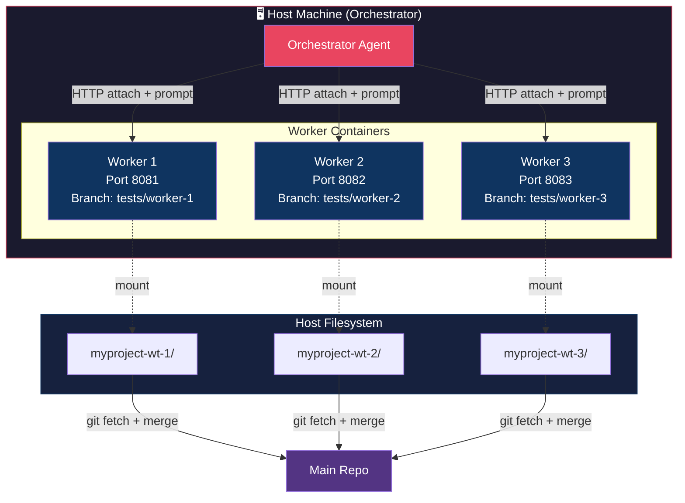
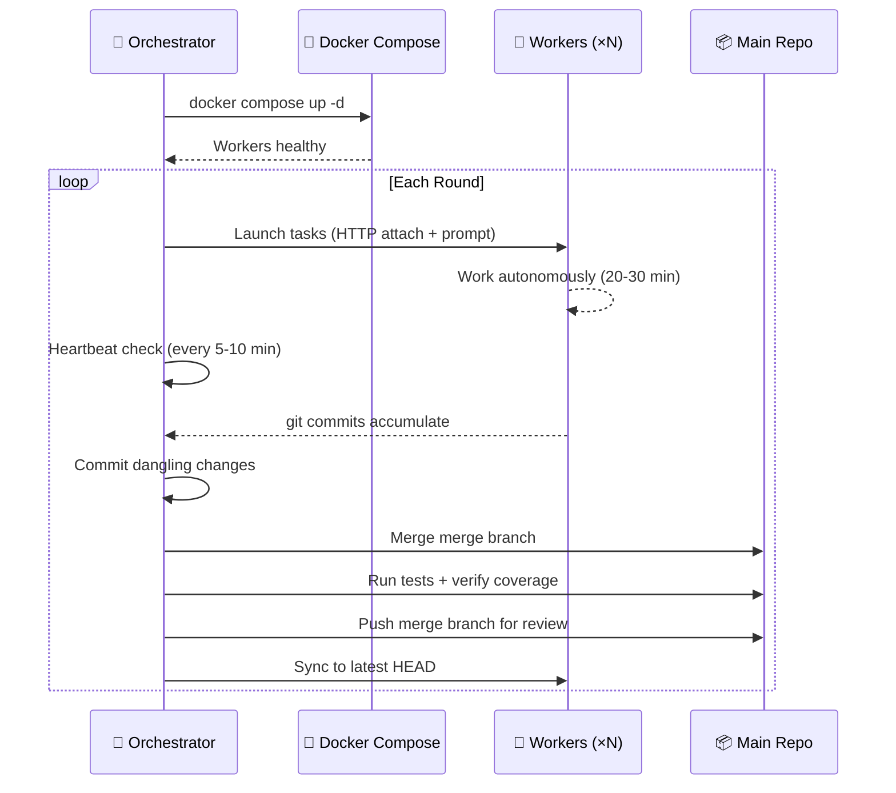

# Worker Swarm

**Run 6–15+ parallel AI coding agents safely using Docker + isolated git branches.**

Turn 20 minutes into 4-8 hours of autonomous output. Designed for large codebases (100k+ LOC) and real daily use.

- **+2.5% test coverage** in ~20 minutes
- **+5% test coverage** in 30 minutes
- **500–800+ commits per day** on a mid-tier rig

> This setup uses separate clones on separate branches instead of git worktrees for better isolation and simpler tooling.

## At a Glance

Run **N AI agents** in parallel, each in its own Docker container with its own git clone and branch. The orchestrator distributes tasks, monitors progress, and merges results after each round.



## How It Works

1. **Init** — Create N isolated git clones, each on its own branch
2. **Launch** — Start Docker containers, one per worker, with bind-mounted clones
3. **Distribute** — Send each worker a unique task (e.g., 8-10 files each)
4. **Work** — Agents edit, test, and commit autonomously in parallel
5. **Merge** — Fetch worker branches, merge results, verify, repeat



## Why Branches Instead of Worktrees?

We use **separate clones on separate branches** instead of `git worktree` because:

- **No tool pollution** — `eslint` and `tsc` won't scan N copies of the same codebase (we saw our error count triple with worktrees)
- **Simpler mental model** — each clone is an isolated folder, no `tsconfig.json` or `eslint` exclude config needed
- **Independent review** — run `/review` on any worker branch without cross-contamination
- **Cleaner cleanup** — `rm -rf` vs `git worktree prune`

The tradeoff is disk space — each clone is a full copy of the repo.

## Quick Start

```bash
# 1. Create worker clones
./scripts/init-worker-clones.sh

# 2. Start containers
docker compose -f docker-compose.opencode.yml up -d

# 3. Launch workers (example)
for i in 1 2 3 4 5 6; do
  PORT=$((8080 + i))
  opencode run --attach "http://localhost:${PORT}" \
    -m "your-model" \
    "Your task prompt here..." \
    > "/tmp/w${i}.log" 2>&1 &
done

# 4. Monitor progress
for i in 1 2 3 4 5 6; do
  cd "myproject-wt-${i}"
  echo "W${i}: $(git log --oneline --since='10 minutes ago' | wc -l) commits"
done

# 5. Merge results
for i in 1 2 3 4 5 6; do
  git fetch "wt-${i}" "tests/worker-${i}"
  git merge "wt-${i}/tests/worker-${i}" --no-edit
done
```

## File Structure

```
myproject/
├── docker-compose.opencode.yml    # Worker container definitions
├── Dockerfile.opencode            # Agent container image
├── docker/
│   └── worker-entrypoint.sh       # Container startup script
├── scripts/
│   ├── init-worker-clones.sh      # One-time clone setup
│   └── cleanup-worker-clones.sh   # Remove clones
├── docs/
│   └── WORKFLOW.md                # Full workflow guide ← deep dive
│
├── myproject-wt-1/                # Worker 1 clone (git remote: wt-1)
├── myproject-wt-2/                # Worker 2 clone (git remote: wt-2)
└── myproject-wt-N/                # Worker N clone (git remote: wt-N)
```

## Model Stack

| Role | Model | Provider | Notes |
|------|-------|----------|-------|
| **Orchestrator** | GLM-5.1 / GLM-5-Turbo | Z.ai | Primary / non-peak fallback |
| **Workers** | MiniMax-M2.7 | MiniMax.io | Fast, affordable for parallel work |

## Cost

Both Z.ai and MiniMax.io are **flat monthly subscriptions** — unlimited usage. The cost doesn't change with more rounds.

| Plan | Monthly | Notes |
|------|---------|-------|
| Z.ai Coding Plan | $30 | GLM-5.1 / GLM-5-Turbo for orchestrator |
| MiniMax.io Standard | $20 | M2.7 for workers |
| **Total** | **$50/mo** | ~$1.67/day, flat regardless of rounds |

**Throughput:** ~40-60 files/round × 3 rounds/day × 30 days = ~3,600-5,400 files/month for $50 flat. MiniMax's highspeed plan ($40/mo instead of $20) roughly doubles worker output per round.

## Full Documentation

The **[WORKFLOW.md](WORKFLOW.md)** guide covers:
- Detailed setup (Dockerfile, compose, entrypoints)
- Worker prompt engineering with examples
- Batch strategy and coverage-driven file selection
- Orchestrator heartbeat & merge cycle
- Safety & best practices
- Troubleshooting
- Detailed cost calculator
- Full automation script

## License

MIT. See [WORKFLOW.md](WORKFLOW.md#license) for full text.

## Contributing

Contributions welcome — better prompts, cost benchmarks, alternative orchestrator patterns, platform adapters. See [WORKFLOW.md](WORKFLOW.md#contributing) for details.
